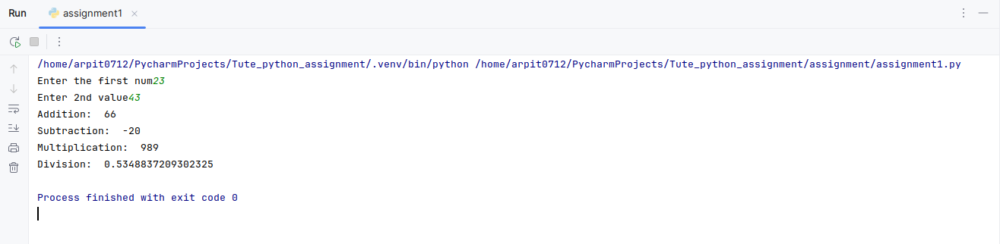
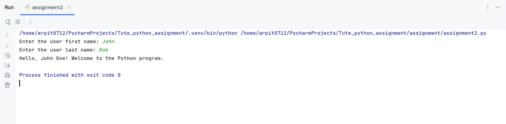

# tute-dude_assignments
# tute-dude_assignments

Task 1: Takes two number from the user as input 
and performs basic operation like addition , substraction
multiplication and division 
the script displays the result for all the operation

Task 2:
The Script takes first and last name of the user
and adds the greetings

